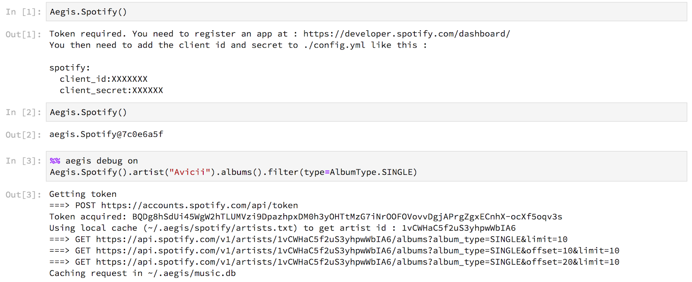
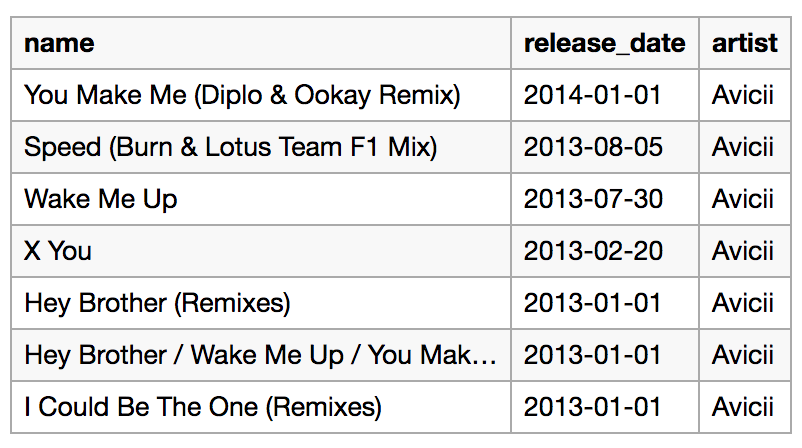
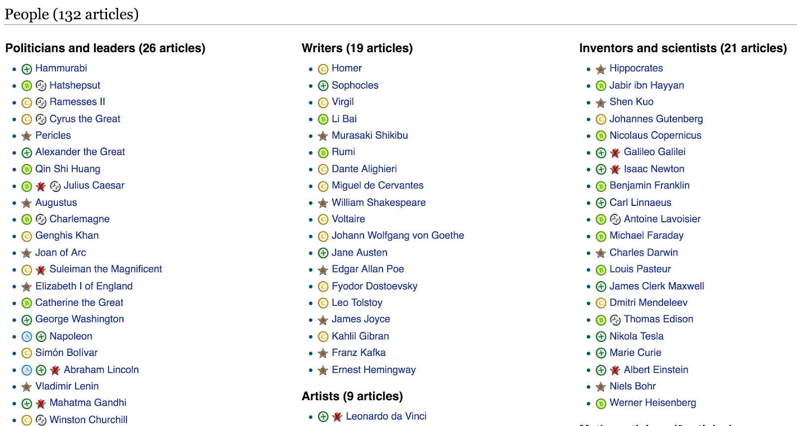
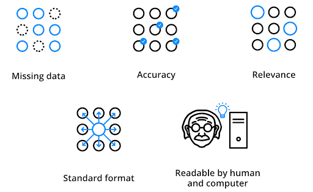

Goal : convention-over-configuration toolchain for manipulating information and data

Wolfram is a good example of such a toolchain, but has a few problems :
- proprietary platform and language
- not a fan of the syntax (C-style instead of calling methods on objects => poor discoverability)
- proprietary => impossible to extend
- hard to export content, good system for humans but bad for computers (difficult to chain operations)

## Vision
Notebook-like interface where you can issue the simplest commands to gather information and display it in the way want.
The system knows where to gather the information (data sources), how to collect it and store it, comes with primitives to manipulate this information and can display it in an interactive fashion.

## Process

## Steps
- Module to connect to the datasource and extract data (most commonly an API, but can be a remote file, a database, …)
- Module to convert the data to standard and shared data structures (Schema.org)
- Aegis core is able to take this data, store it and query it as required. For example, if someone wants a list of all Jazz songs releasing in 1975 :
  - if the Data Source API allows to query for both year and style, use the API
  - if the API allows for none, query everything, store in a database and query for year and style
  - if the API allows year but not style, query through the API for year, store in a database and query for style
- Modules for representation and display (defaults are provided)

## Sources & Trust

Multiple data sources could have conflicting information (ex : number of people in a manifestation). The system should be able to handle this kind of ambiguity with how much clarity to the user as possible.
If an information is provided to the user, the source should also be displayed (might be through a context bubble)
If there are conflicting values for a query or an uncertainty (ie, almost anything), the answers should be given with an amount of confidence.

Confidence should be an aggregate of much trust is placed in the sources and how certain are the sources on their data.
The aggregation of multiple sources should have a multiplicative effect (if you have two sources you trust at 90% telling you independently the same info, your trust should now be higher than 90%)

A default trust index for the system’s sources should be provided (ex : sources_trust.yml), but it could be overridden by the user.

Relevance and Magnitude
Not all data points has the same relevance.
For example, Wikipedia currently curates lists of varying sizes of [Vital articles](https://en.wikipedia.org/wiki/Wikipedia:Vital_articles) (10, 100, 1k, 10k, 50k)

In the same way, not all information about a data point have the same relevance.

The system should be able to score its different pieces of data and evaluate what is more relevant.
A proposed metric here is “magnitude”, defined by the logarithm of how many people would remember this information X time in the future.
Some values would be :
- Magnitude 1 : one person remembers the event 1 hour later
- Magnitude 2 :
  - one person remembers the event 1 day later (smaller than an anecdote)
  - 10 people remembers the event 1 hour later (someone mispronounces a word)
- Magnitude 5 :
  - only one person remembers the event 1 year later
  - 10k people remember the event 1 hour later (minor event on a radio show)
  - 100 people remember the event a week later (public dispute)
- Magnitude 10 :
  - 10k people remember the event a year later (city-wide event)
- Magnitude 15 :
  - 10M people remember the event ten years later (country-wide event)
- Magnitude 20 :
  - 1B people remember the event 10.000 years later (planet-wide event)

So for example, Julius Caesar is still know by 1B people 2000 years later, so the magnitude associated would be ~19
Kafka should be known by 100M people a century later, so the magnitude associated would be ~17
A minor secretary of state in France, with no particular event in its life, could be known by 100k people 10 years later, so a magnitude would be ~12
Someone hitting lightly another car with his own would be a small event, remembered by <100 people a few years afterwards, so magnitude ~8.5

The magnitude could be inferred from other metrics (popularity on IMDB for movies, on Spotify or Youtube for music, …)
Magnitude is independent from a given user, but could be used as a base for scoring relevance for a given user

